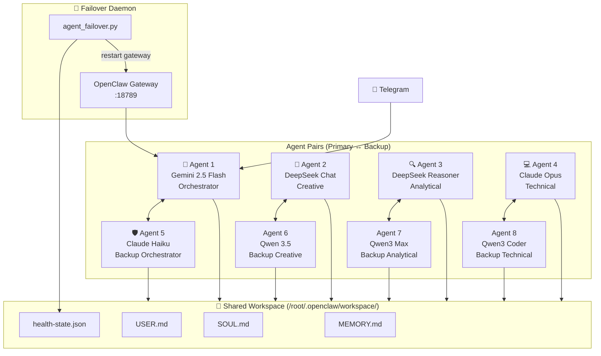
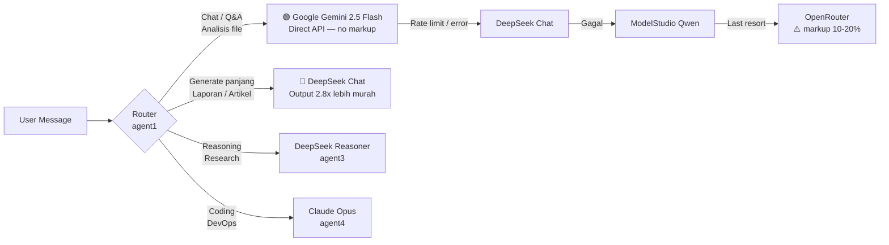
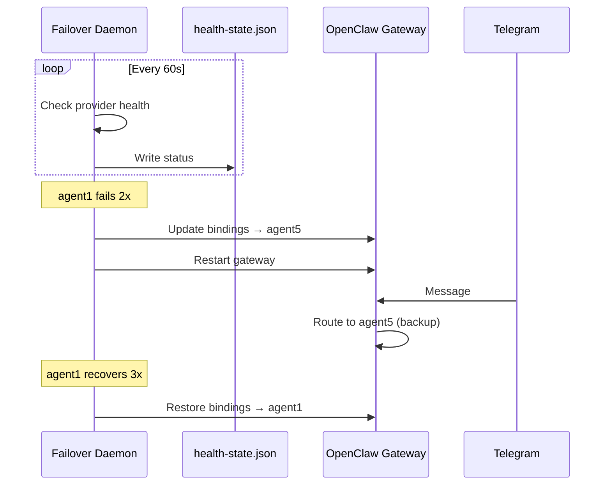

# 🦞 OpenClaw Multi-Agent System

> 8-agent AI system with shared memory, smart model routing, auto-failover, and Telegram integration.

---

## Architecture



---

## Model Routing



### Model per Agent

| Agent | Role | Primary | Fallback Chain |
|-------|------|---------|----------------|
| **agent1** | Orchestrator / Chat | `google/gemini-2.5-flash` | DeepSeek → Qwen → OpenRouter |
| **agent2** | Creative / Long-form | `deepseek/deepseek-chat` | Qwen → Claude Haiku → OpenRouter |
| **agent3** | Analytical / Reasoning | `deepseek/deepseek-reasoner` | Qwen Max → DeepSeek → OpenRouter |
| **agent4** | Technical / Coding | `anthropic/claude-opus-4-6` | Claude Haiku → Qwen Coder → DeepSeek |
| **agent5** | Backup Orchestrator | `anthropic/claude-haiku-4-5` | Qwen → DeepSeek → OpenRouter |
| **agent6** | Backup Creative | `modelstudio/qwen3.5-plus` | DeepSeek → Claude Haiku → OpenRouter |
| **agent7** | Backup Analytical | `modelstudio/qwen3-max` | DeepSeek Reasoner → Qwen → OpenRouter |
| **agent8** | Backup Technical | `modelstudio/qwen3-coder-next` | Qwen Coder Plus → DeepSeek → Claude Haiku |

---

## Shared Memory Structure

```
/root/.openclaw/workspace/
├── SOUL.md          ← Agent personality & identity
├── USER.md          ← User profile (mas Aris)
├── MEMORY.md        ← Long-term shared memory
├── AGENTS.md        ← Agent roles & routing rules
├── SYNC.md          ← Multi-agent sync protocol
├── TOOLS.md         ← Tool configs & credentials
├── health-state.json ← Live agent health (written by daemon)
├── memory/          ← Daily logs per date
│   └── YYYY-MM-DD.md
├── diary/           ← Agent reflections
├── tasks/           ← Lessons learned
└── scripts/         ← Utility scripts
```

Each agent reads the same shared workspace but has its own identity files:

```
/root/.openclaw/agents/agentN/agent/
├── SOUL.md          ← Agent-specific personality
├── AGENTS.md        ← Agent-specific routing rules
├── IDENTITY.md      ← Name, emoji, vibe
├── USER.md          ← User profile copy
└── auth-profiles.json ← API keys for this agent
```

---

## Failover System



### Pair System

| Primary | Backup | Failover Chain |
|---------|--------|----------------|
| agent1 | agent5 | agent1 → agent5 → agent6 → agent7 → agent8 |
| agent2 | agent6 | agent2 → agent6 → agent7 |
| agent3 | agent7 | agent3 → agent7 → agent8 |
| agent4 | agent8 | agent4 → agent8 → agent5 |

---

## Installation

### Prerequisites

```bash
# Node.js v22+
curl -o- https://raw.githubusercontent.com/nvm-sh/nvm/v0.40.0/install.sh | bash
nvm install 22 && nvm use 22

# Install OpenClaw
npm install -g openclaw

# Python 3 (for failover daemon)
python3 --version
```

### 1. Clone repo

```bash
git clone https://github.com/arist130194/openclaw-agents.git ~/openclaw
cd ~/openclaw
```

### 2. Setup API Keys

```bash
cp .env.example .env
nano .env   # isi dengan key asli
```

```env
ANTHROPIC_API_KEY=sk-ant-...
DEEPSEEK_API_KEY=sk-...
OPENROUTER_API_KEY=sk-or-v1-...
DASHSCOPE_API_KEY=sk-...
GOOGLE_API_KEY=AIzaSy...
```

### 3. Setup OpenClaw

```bash
# Init wizard
openclaw wizard

# Copy agent configs
for i in 1 2 3 4 5 6 7 8; do
  mkdir -p ~/.openclaw/agents/agent$i/agent
  cp agents/agent$i/SOUL.md ~/.openclaw/agents/agent$i/agent/
  cp agents/agent$i/AGENTS.md ~/.openclaw/agents/agent$i/agent/
done

# Copy workspace
cp -r workspace/* ~/.openclaw/workspace/
```

### 4. Mulai failover daemon

```bash
chmod +x agents/start_failover.sh
./agents/start_failover.sh start

# Cek status
./agents/start_failover.sh status

# Lihat log
./agents/start_failover.sh log
```

### 5. Jalankan OpenClaw TUI

```bash
openclaw tui
```

### 6. TUI Watchdog (opsional)

Untuk recovery otomatis kalau TUI hang / stale lock setelah Ctrl+C:

```bash
chmod +x tui_watchdog.sh

# One-time cleanup
./tui_watchdog.sh clean

# Background monitor (check tiap 30 detik)
./tui_watchdog.sh watch 30
```

---

## Environment Variables

| Key | Provider | Keterangan |
|-----|----------|------------|
| `ANTHROPIC_API_KEY` | Anthropic | Claude Opus / Haiku |
| `DEEPSEEK_API_KEY` | DeepSeek | DeepSeek Chat / Reasoner |
| `OPENROUTER_API_KEY` | OpenRouter | Universal fallback |
| `DASHSCOPE_API_KEY` | ModelStudio | Qwen series |
| `GOOGLE_API_KEY` | Google AI Studio | Gemini direct (no markup) |

> ⚠️ Gunakan API key berbeda untuk setiap server (lokal vs VPS) agar tidak berebut rate limit.

---

## Scripts

| Script | Fungsi |
|--------|--------|
| `agents/start_failover.sh start` | Jalankan failover daemon |
| `agents/start_failover.sh status` | Cek health semua agent |
| `agents/start_failover.sh log` | Tail log daemon |
| `tui_watchdog.sh check` | Bersihkan stale locks + cek status |
| `tui_watchdog.sh watch 30` | Background monitor TUI |
| `scripts/check-all-balances.sh` | Cek saldo semua API provider |

---

## References

- [OpenClaw Multi-Agent System](https://github.com/fanani-radian/openclaw-sumopod/blob/main/tutorials/openclaw-multi-agent-system.md)
- [Multi-Agent Shared Memory](https://github.com/fanani-radian/openclaw-sumopod/blob/main/tutorials/multi-agent-shared-memory.md)
